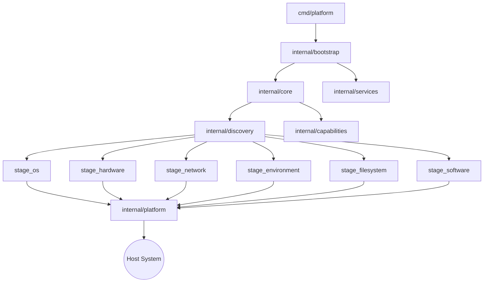
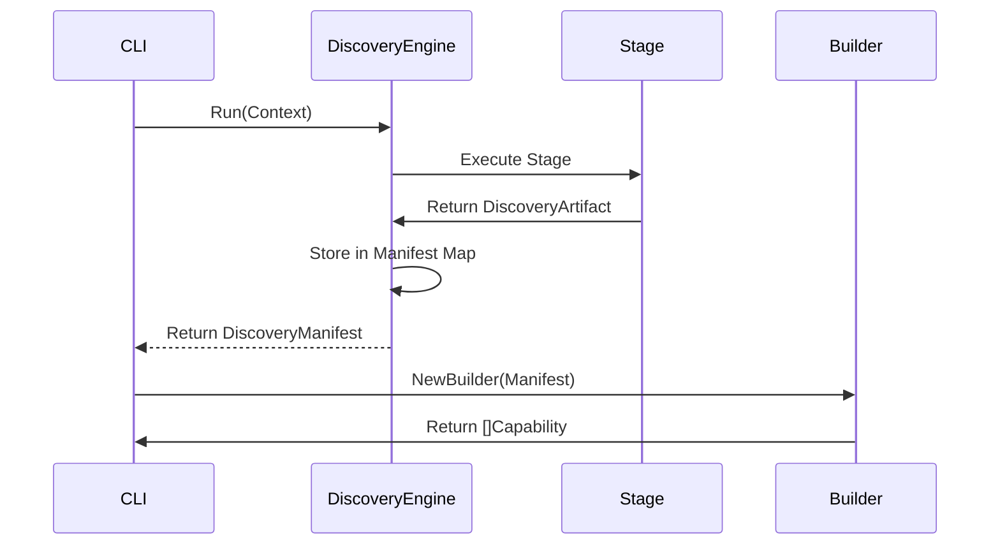
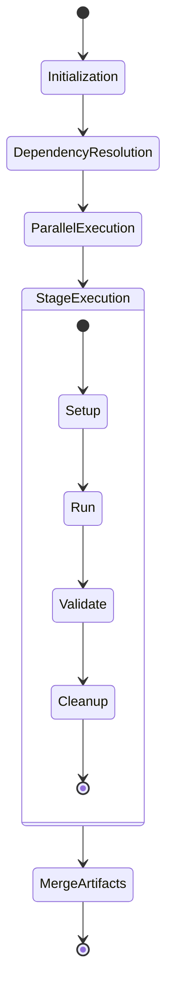

# System Diagrams

## Repository Architecture

```mermaid
graph TD
    CLI[cmd/platform] --> Bootstrap[internal/bootstrap]
    Bootstrap --> Core[internal/core]
    Bootstrap --> Services[internal/services]
    
    Core --> Discovery[internal/discovery]
    Core --> Capabilities[internal/capabilities]
    
    Discovery --> StageOS[stage_os]
    Discovery --> StageHW[stage_hardware]
    Discovery --> StageNet[stage_network]
    Discovery --> StageEnv[stage_environment]
    Discovery --> StageFS[stage_filesystem]
    Discovery --> StageSoft[stage_software]
    
    StageOS --> PlatformAbstraction[internal/platform]
    StageHW --> PlatformAbstraction
    StageNet --> PlatformAbstraction
    StageEnv --> PlatformAbstraction
    StageFS --> PlatformAbstraction
    StageSoft --> PlatformAbstraction

    PlatformAbstraction --> HostOS((Host System))
```

## Artifact Flow

```mermaid
sequenceDiagram
    participant CLI
    participant DiscoveryEngine
    participant Stage
    participant Builder
    
    CLI->>DiscoveryEngine: Run(Context)
    DiscoveryEngine->>Stage: Execute Stage
    Stage->>DiscoveryEngine: Return DiscoveryArtifact
    DiscoveryEngine->>DiscoveryEngine: Store in Manifest Map
    DiscoveryEngine-->>CLI: Return DiscoveryManifest
    CLI->>Builder: NewBuilder(Manifest)
    Builder->>CLI: Return []Capability
```

## Discovery Pipeline Lifecycle

```mermaid
stateDiagram-v2
    [*] --> Initialization
    Initialization --> DependencyResolution
    DependencyResolution --> ParallelExecution
    ParallelExecution --> StageExecution
    
    state StageExecution {
        [*] --> Setup
        Setup --> Run
        Run --> Validate
        Validate --> Cleanup
        Cleanup --> [*]
    }
    
    StageExecution --> MergeArtifacts
    MergeArtifacts --> [*]
```

