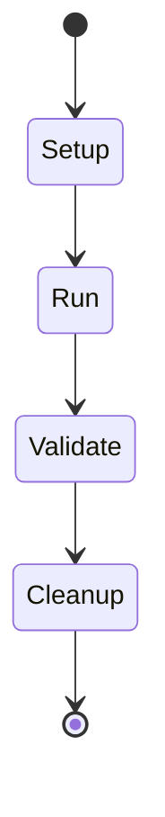

# Discovery Engine

The Discovery Engine (`internal/discovery/engine.go`) is responsible for orchestrating the environment interrogation lifecycle.

## Pipeline Lifecycle
When `Run()` is invoked on the Discovery Engine, the following execution flow triggers:

1. **Initialization**: The Engine receives a slice of `Stage` structures and mounts them.
2. **Dependency Validation**: The engine verifies that no stages rely on missing dependencies, and ensures there are no circular dependency loops using Depth-First Search (DFS). It then sorts stages by their Priority level.
3. **Execution**: Stages are run. Stages within the same dependency tier are executed concurrently in goroutines.
4. **Aggregation**: The artifacts output by the Stages are aggregated into the central `DiscoveryManifest`.

## Execution Flow

## Error Handling and Cancellation
- If a Stage returns an error during `Run()`, the pipeline does **not** panic. It flags the StageStatus as `Failed` and skips subsequent stages that depend on it.
- If a Stage violates its declared `Timeout()`, the engine forces cancellation via `context.Context`.
