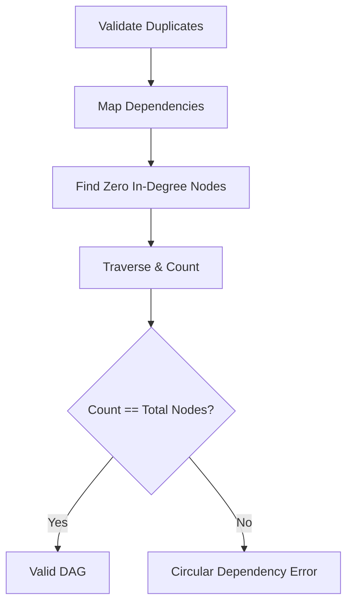

# Pipeline Validation

Before execution begins, the engine strictly validates the pipeline topology via `internal/discovery/validator.go`.

## Validations Performed

### 1. Unique Stage Names
The engine errors if two stages declare the exact same `Name()`.

### 2. Dependency Resolution
If Stage B declares it `DependsOn([]string{"Stage A"})`, the engine verifies that `Stage A` is actually registered in the current pipeline matrix.

### 3. Circular Dependency Detection
The engine utilizes Topological Sorting to detect cycles in the Directed Acyclic Graph (DAG). 
If Stage A depends on Stage B, and Stage B depends on Stage A, the system guarantees a crash at initialization rather than a runtime deadlock.

## Implementation (Topological Sort)

