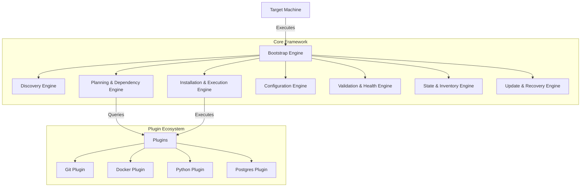
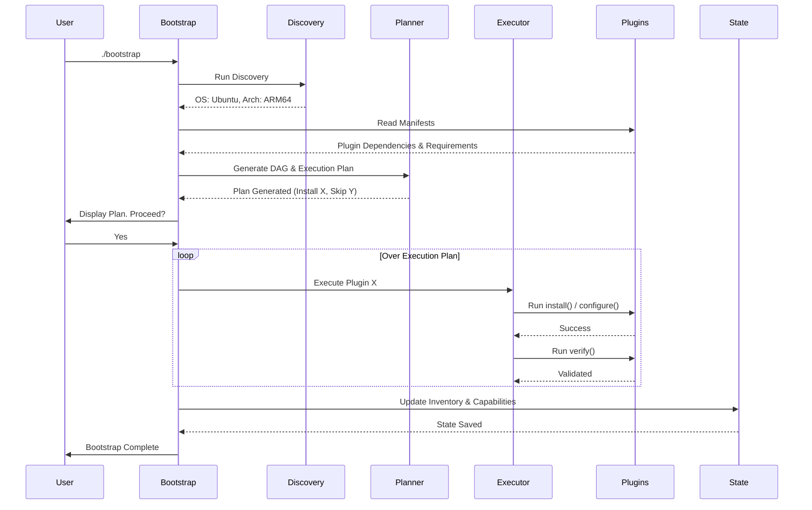
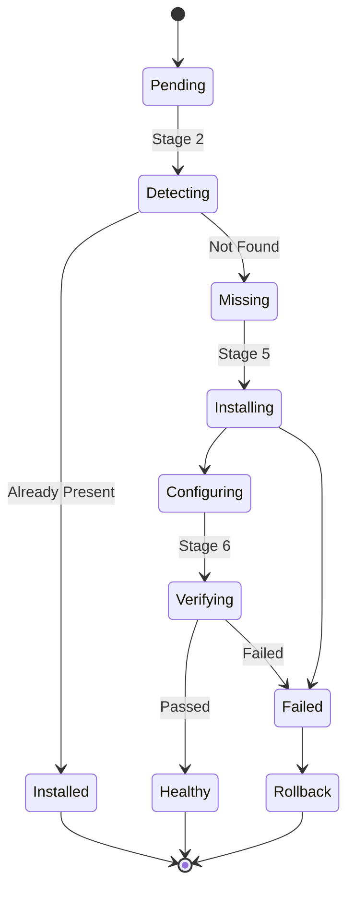

# Universal Bootstrap Framework Architecture Design

> [!NOTE]
> This document describes the architecture of the Universal Bootstrap Framework, a production-grade, self-hosted engineering platform designed to provision, configure, validate, update, recover, and maintain heterogeneous environments.

## 1. Engineering Principles and Non-Functional Requirements

### Core Principles
- **Core vs. Plugin Separation**: The framework core is ignorant of specific technologies. It only understands discovery, planning, execution, state, and updating. All technology-specific logic (Git, Docker, Python) resides in plugins.
- **Idempotency**: Every operation can be run multiple times safely. Running the bootstrap on an already configured machine results in zero changes and a successful exit.
- **Fail-Safe & Recoverable**: Operations are atomic where possible. Failures trigger automatic rollback or safe state restoration.
- **Declarative Intent over Imperative Steps**: The system builds a dependency graph and execution plan based on desired state and current capabilities, rather than executing a hardcoded list of scripts.
- **Autonomous Operation**: Once installed, the system can self-update, run periodic health checks, and maintain state without manual intervention.

### Non-Functional Requirements (NFRs)
- **Portability**: Must run on Windows, Linux (Debian, Ubuntu), Raspberry Pi (ARM), Android Termux, Ubuntu PRoot, and various VPS architectures.
- **Maintainability**: Designed for a 5-10 year lifespan. Core must remain stable while plugins evolve.
- **Observability**: Every action, decision, and failure is logged structurally for easy parsing and aggregation.
- **Security**: No `curl | bash` pipelines for execution. Cryptographic verification of downloaded assets. Minimal privileges required where possible.
- **Performance**: Fast capability detection. Parallel execution of independent branches in the dependency graph.

---

## 2. Repository Architecture

The repository is strictly divided between the Core Infrastructure and the Extensible Plugins.



---

## 3. Bootstrap Lifecycle

The lifecycle follows a strict sequence of phases. If a phase fails, the process halts or rolls back.

1. **Initialization**: Load core engine and parse CLI arguments.
2. **Discovery (Stage 1)**: Interrogate the host OS, architecture, hardware, and network capabilities.
3. **Capability Detection (Stage 2)**: Check existing software installations and versions.
4. **Planning & Resolution (Stage 3 & 4)**: Construct a Directed Acyclic Graph (DAG) of required dependencies versus current state. Generate an Execution Plan.
5. **Execution & Installation (Stage 5)**: Execute the plan. Install missing components, upgrade outdated ones.
6. **Configuration (Stage 5)**: Apply configurations (dotfiles, daemon configs, environment variables).
7. **Validation & Verification (Stage 6)**: Run test suites provided by plugins to ensure functional correctness.
8. **Health Check & Registration (Stage 7 & 8)**: Calculate overall health score, register the device inventory in the local state.
9. **Maintenance (Stage 9)**: Hook into system startup/cron for continuous background updates.

---

## 4. Engine Deep Dives

### 4.1 Discovery Engine
Responsible for answering: *What is this machine?*
- Gathers hardware specs (CPU architecture, RAM, GPU).
- Identifies OS, Kernel, and active init system (systemd, Windows Services, Termux init).
- Identifies the native package manager (apt, winget, pacman, pkg).

### 4.2 Dependency Resolution Engine
- Plugins declare dependencies (e.g., `docker` requires `container-toolkit`, `python` requires `build-essential`).
- Builds a topological sort (DAG) of all requested plugins.
- Detects circular dependencies and aborts if found.

### 4.3 Plugin/Module Architecture
Plugins are isolated directories containing:
- `manifest.yaml`: Declares dependencies, supported OS/arch, and versions.
- `detect`: Script/function to check if it's already installed.
- `install`: Script/function to install the component idempotently.
- `configure`: Script/function to configure the component.
- `verify`: Script/function to test the component (e.g., `docker run hello-world`).

### 4.4 Configuration Management
- Uses a hierarchical merging strategy (Default -> OS Specific -> Host Specific -> User Override).
- Capable of templating (e.g., injecting the discovered hostname into a config file).

### 4.5 State & Inventory Management
- Maintains a local `.state.json` or SQLite database.
- Records the last known good configuration, installed plugin versions, and device UUID.
- Acts as the single source of truth for the Update Engine.

### 4.6 Logging and Observability
- All outputs are captured. Standard out is human-readable (with colors and emojis for UX), while a structured JSON log is written to disk.
- Log levels: TRACE, DEBUG, INFO, WARN, ERROR, FATAL.

### 4.7 Update and Rollback Strategy
- **Update**: Background agent periodically fetches the latest Git tag. If a new version exists, it downloads it, validates signatures, and applies changes.
- **Rollback**: If an update fails verification, the engine restores the previous `.state.json` and reverts binary/config symlinks.

---

## 5. Security Model
- **Least Privilege**: The framework runs with user privileges where possible, only escalating to `sudo`/Administrator for specific package installations.
- **Asset Verification**: Downloads (e.g., binaries) are checked against SHA256 checksums declared in the plugin manifests.
- **No Remote Code Execution Pipelines**: External scripts are downloaded, verified, and then executed locally, never piped directly to a shell.

---

## 6. Testing & CI/CD Architecture
- **Unit Tests**: Test the Core engines (DAG resolution, state merging) independently.
- **Integration Tests**: Test plugins against specific target states.
- **CI/CD Pipeline**: GitHub Actions matrix testing against Windows, Ubuntu, Debian, and ARM runners. Every commit builds a release artifact.

---

## 7. File and Directory Structure

```text
base-infrastructure/
├── bootstrap                  # Main entrypoint script (Bash/PS1/Go)
├── core/                      # Core Framework Engine
│   ├── discovery/             # Hardware & OS detection
│   ├── planner/               # DAG generation and diffing
│   ├── executor/              # Task runner
│   ├── state/                 # Inventory and state management
│   ├── update/                # Self-updater
│   └── logger/                # Structured logging
├── plugins/                   # Technology-specific modules
│   ├── git/
│   │   ├── manifest.yaml
│   │   ├── detect.sh
│   │   └── install.sh
│   ├── docker/
│   ├── python/
│   └── pocketbase/
├── config/                    # Global configurations and templates
│   ├── default.yaml
│   └── windows.yaml
├── tests/                     # Framework testing suite
└── docs/                      # Documentation
```

---

## 8. Diagrams

### 8.1 Sequence Diagram: Bootstrap Execution



### 8.2 State Diagram: Plugin Lifecycle



---

## 9. Example Execution Flow for a Brand-New Machine

1. **User Action**: `git clone https://.../base-infrastructure.git && cd base-infrastructure && ./bootstrap`
2. **Stage 1 (Discovery)**: Framework detects `Ubuntu 24.04 LTS`, `x86_64`, `16GB RAM`, `systemd`, `apt`.
3. **Stage 2 (Capability Detection)**:
   - Git: `Found v2.43` -> Skip install.
   - Python: `Not found`.
   - Docker: `Not found`.
4. **Stage 3 & 4 (Planning)**: Builds plan:
   - Task 1: Install Python (depends on apt).
   - Task 2: Install uv (depends on Python).
   - Task 3: Install Docker (depends on apt).
5. **Stage 5 (Installation & Configuration)**:
   - Executes Python plugin installation.
   - Executes Docker plugin installation.
   - Configures Docker (adds user to `docker` group).
6. **Stage 6 (Verification)**:
   - Runs `python3 --version`.
   - Runs `docker run hello-world`.
7. **Stage 7 & 8 (Health & Registration)**:
   - Writes `~/.local/state/base-infra/inventory.json` with UUID and capabilities. Health score: 100%.
8. **Stage 9 (Update Agent)**:
   - Installs a systemd timer `base-infra-updater.timer` to run daily.

---

## 10. Design Rationale and Trade-offs

- **Decoupled Plugins vs. Monolithic Scripts**: 
  - *Rationale*: Allows infinite scaling of capabilities without polluting the core logic. 
  - *Trade-off*: Slightly higher overhead to parse manifests and dynamically load modules compared to a flat bash script.
- **State File vs. Stateless Execution**:
  - *Rationale*: Maintaining an inventory file (`.state.json`) allows the Update Engine to know exactly what was installed previously, enabling diffs and intelligent upgrades rather than blindly re-running everything.
  - *Trade-off*: State files can drift from reality if a user manually uninstalls a tool. The *Capability Detection* phase must reconcile the state file against physical reality on every run.
- **Target Language (Bash/Go/Rust)**:
  - While not explicitly chosen yet, the core engine should be written in a language that is highly portable or compiled to a static binary (like Go or Rust) to avoid massive bootstrapping dependencies (like requiring Python to install Python). If using Bash/PowerShell, the core must be strictly POSIX compliant or rely on native OS capabilities.
